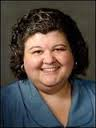
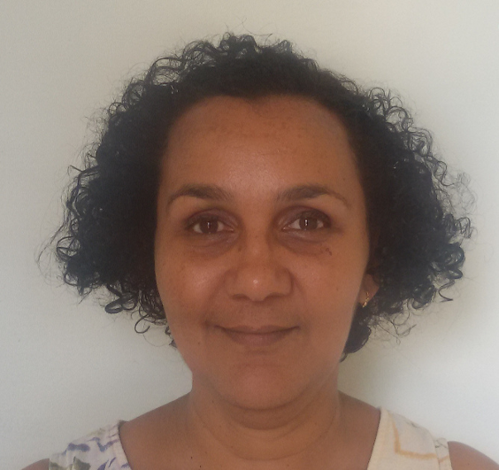

##########
Profesores
##########

*****************
Andrea Lowden, MD
*****************

* Consultante en Epilepsia Pediátrica. División de Neurología Pediátrica. Centro Medico UT Southwestern

*****************
Emily Gilmore, MD
*****************

.. image:: images/gilmore.jpg
    :width: 100 px

* Profesor Asociado de Neurología. Neurointensivista. Hospital New Haven-Yale Universidad de Yale

************************
Naymee J Vélez-Ruiz, MD
************************

* Profesor Asociado de Neurología – Universidad de Miami
* Experto en Monitorización de EEG continuo en UCI

*****************
Sarah Schmitt, MD
*****************

.. image:: images/Schmitt-Sarah-Neurology.jpg
    :width: 100 px

* Profesor Asociado de Neurología – Universidad Médica de Carolina del Sur
* Experto en Monitorización de EEG continuo en UCI
* Miembro de la Sociedad Norteamericana de Neurofisiología Clínica
* Miembro del Consorcio de Investigación con EEG en los cuidados críticos

******************
Susan T Herman, MD
******************

* Profesor Asociado de Neurología – Centro Médico Beth Israel Deaconess, Escuela de Medicina Universidad de Harvard
* Experto en Monitorización de EEG continuo en UCI
* Miembro de la Sociedad Norteamericana de Neurofisiología Clínica
* Miembro del Consorcio de Investigación con EEG en los cuidados críticos

*********************
Suzette M Laroche, MD
*********************

* Profesor Asociado de Neurología – Mission Health, Asheville Carolina del Norte
* Experto en Monitorización de EEG continuo en UCI
* Miembro del Ejecutivo de la Sociedad Norteamericana de Neurofisiología Clínica
* Ex-Director del Consorcio de Investigación con EEG en los cuidados críticos
* Editor del Handbook of ICU EEG Monitoring, 2013 Demos Publishing

***********************
Valia Rodriguez, MD PhD
***********************

* Profesor e Investigador Titular en Centro de Neurociencias de Cuba.
* Neurofisiólogo Clínico en Unidad de Cuidados Intensivos, Hospital Hnos Ameijeiras, La Habana
* Miembro del Ejecutivo del Capítulo Cubano de Neurofisiología Clínica
